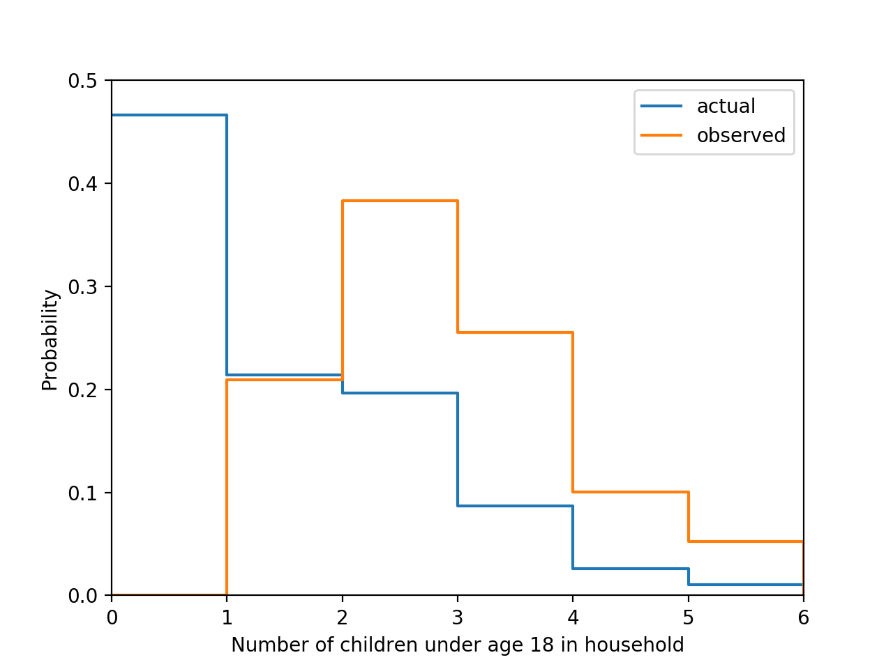

[Think Stats Chapter 3 Exercise 1](http://greenteapress.com/thinkstats2/html/thinkstats2004.html#toc31) (actual vs. biased)

```
#####Q2. Think Stats, Chapter 3 Exercise 1  
##Statement of problem  
#Using data from The National Survey of Family Growth, I need to construct the actual distribution of the number of children under 18 in a household. Then I compare this distribution to the biased distribution taken from surveying children about the number of children under 18 in their household. To compare the two distributions, I need to plot both distributions and calculate their mean values.  

##Solution  
#to construct the actual distribution of the number of children under 18 in a household  
#The larger problem statement relates to the concept of probabilities, specifically the probability mass function (PMF). The PMF, being a normalized distribution of frequencies, is useful for dealing with the type of problem addressed here. The problem requires a comparison between distributions where there is a difference in sample size. I address this by calculating the pmf of the actual distribution. I also calculate the mean value.

import pandas as pd
import matplotlib.pyplot as plt
import nsfg

def pmfF(freqtable, n):
    pmf = freqtable / n
    return pmf

def pmf2distmean(n, pmf):
    distmean = sum(pmf.index * pmf)
    return distmean

df = nsfg.ReadFemResp()
df.columns
#columns of interest: 
#df.numkdhh -> NUMBER OF BIO/ADOPT/RELATED/LEGAL CHILDREN UNDER AGE 18 IN HOUSEHOLD

nChildSeries = df[‘numkdhh’]
nChildSeriesFreq = nChildSeries.value_counts()
n = df.shape[0]

print(‘pmf, actual distribution:’)
pmfActual = pmfF(nChildSeriesFreq, n)
print(pmfActual)


print(‘mean, actual distribution:’)
pmf2distmean(n, pmfActual) #1.0242051550438309


#the biased distribution taken from surveying children about the number of children under 18 in their household
#I calculate the pmf and mean value for the biased observations.
biasedChildFreq = nChildSeriesFreq.index * nChildSeriesFreq
biasedChildFreq = pd.Series(biasedChildFreq)
n = biasedChildFreq.sum()

print(‘pmf, biased distribution:’)
pmfBiased = pmfF(biasedChildFreq, n)
print(pmfBiased)

print(‘mean, biased distribution:’)
pmf2distmean(n, pmfBiased) #2.4036791006642821


#to plot both distributions
pmfActual.loc[6] = 0
pmfBiased.loc[6] = 0
plt.step(pmfActual.index, pmfActual, where = ‘post’, label = ‘actual’)
plt.step(pmfBiased.index, pmfBiased, where = ‘post’, label = ‘observed’)

plt.xlabel(‘Number of children under age 18 in household’)
plt.ylabel(‘Probability’)

plt.xlim(0,len(pmfActual)-1)
plt.ylim(0, 0.5)

plt.legend()
plt.show()
```
  
  
The plot of both distributions is shown below.  
 
