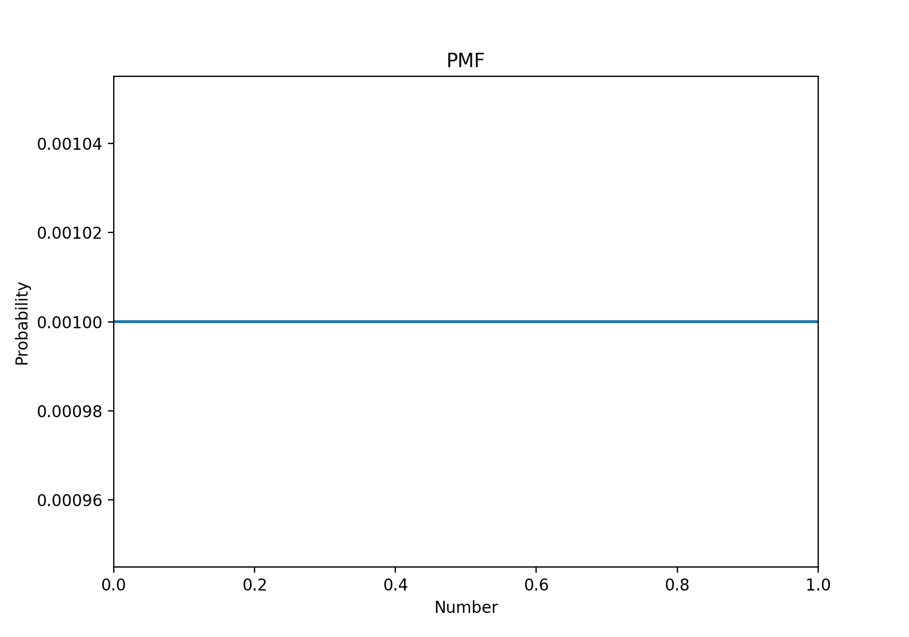
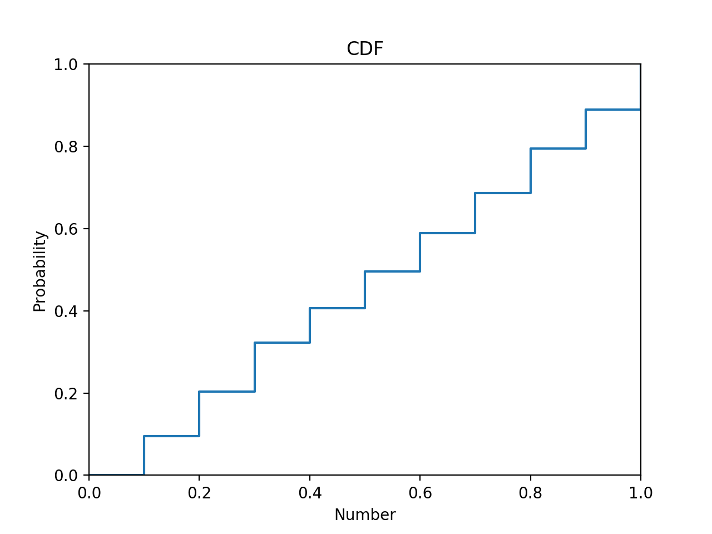

[Think Stats Chapter 4 Exercise 2](http://greenteapress.com/thinkstats2/html/thinkstats2005.html#toc41) (a random distribution)

```
#####Q3. Think Stats, Chapter 4 Exercise 2  
##Statement of problem  
Use the random module within python to generate 1000 random numbers. Use plots of PMF and CDF to determine whether the distribution is random.  

##Solution

import random
import pandas as pd
import matplotlib.pyplot as plt


def pmfF(freqtable, n):
    pmf = freqtable / n
    return pmf

def cdfF(sample, x):
   count = 0
   for value in sample:
      if value < = x:
         count += 1
   prob = count / len(sample)
   return prob


list = []
for i in range(1000):
   list.append(random.random())

listSeries = pd.Series(list)
listFreq = listSeries.value_counts()
n = listSeries.shape[0]


pmf = pmfF(listFreq, n)


cdf = []
iList = [x * 0.1 for x in range(0,11)]
for i in iList:
   cdfAtValue = cdfF(list, i)
   cdf.append(cdfAtValue)


#PMF
plt.step(pmf.index, pmf)

plt.xlabel(‘Number’)
plt.ylabel(‘Probability’)
plt.title(‘PMF’)

plt.xlim(0,1)

plt.show()


#CDF
iList.append(1.1)
cdf.append(1.1)
plt.step(iList, cdf, where = ‘post’)

plt.xlabel(‘Number’)
plt.ylabel(‘Probability’)
plt.title(‘CDF’)

plt.xlim(0,1)
plt.ylim(0,1)

plt.show()

## Yes, the distribution of numbers generated by the random method of the random module is uniform. This is supported by the constant probability value of 0.001 across all numbers in the PMF and the  step increases in probability being proportional to increases in the number value in the CDF.
```
  
  
The PMF and CDF plots are shown below.


